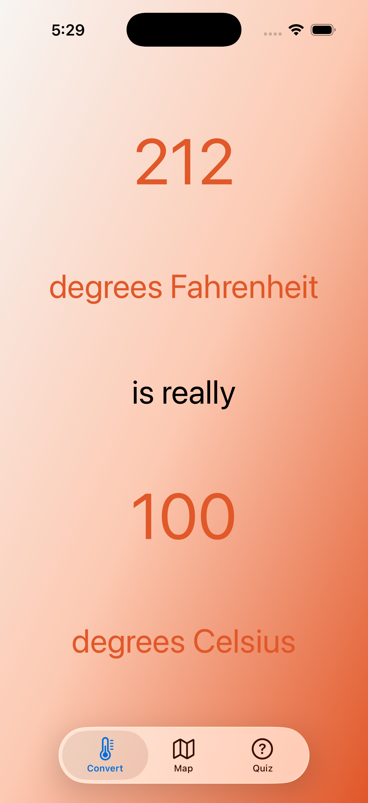
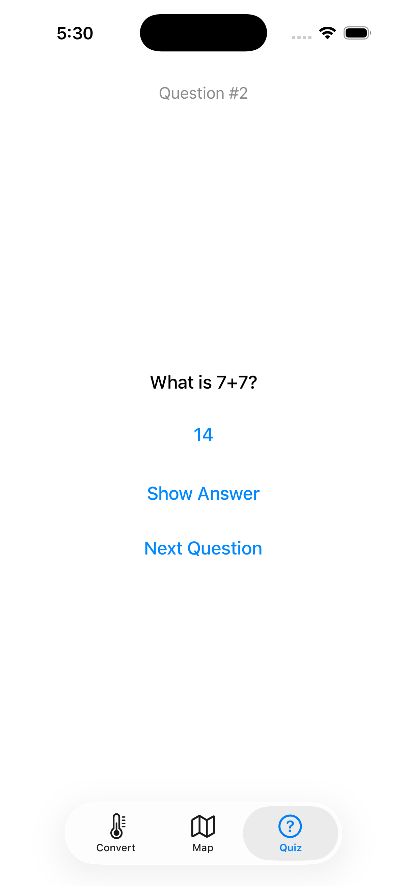
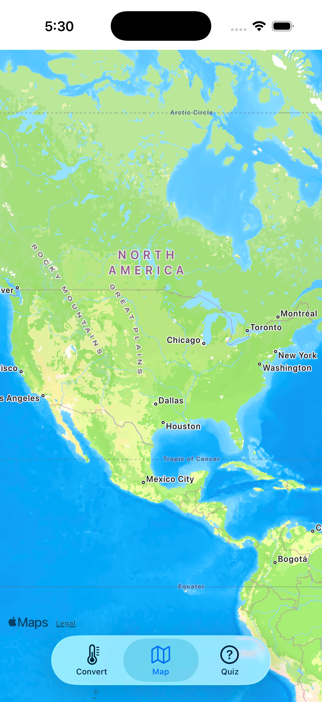
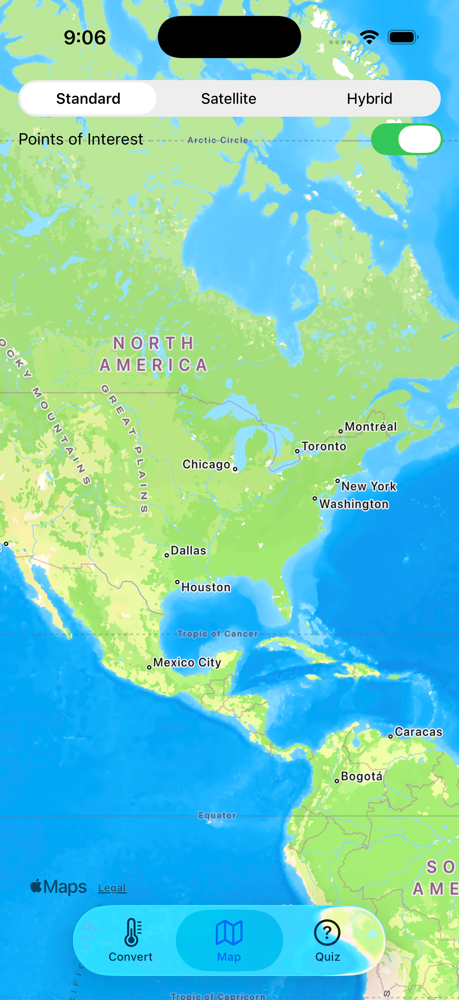
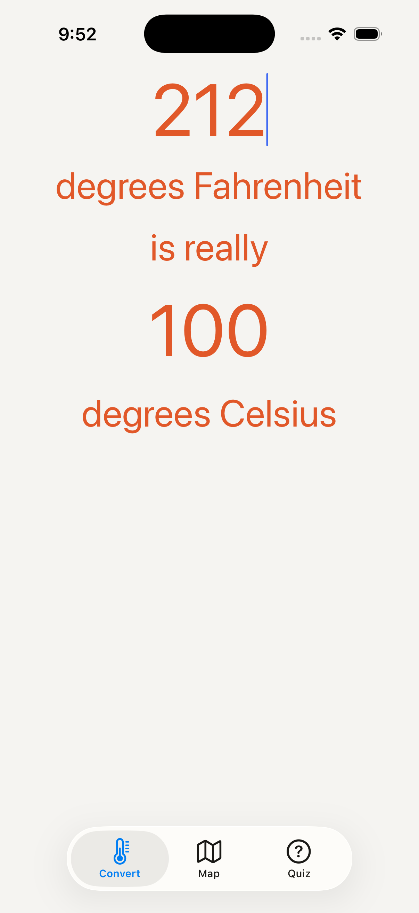
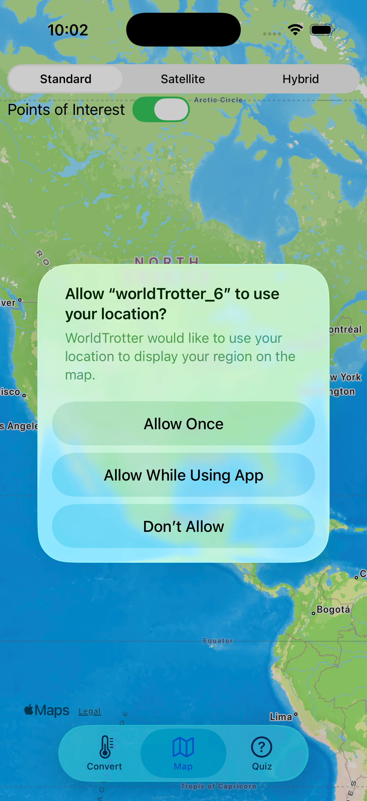
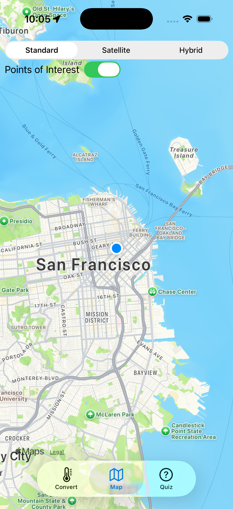
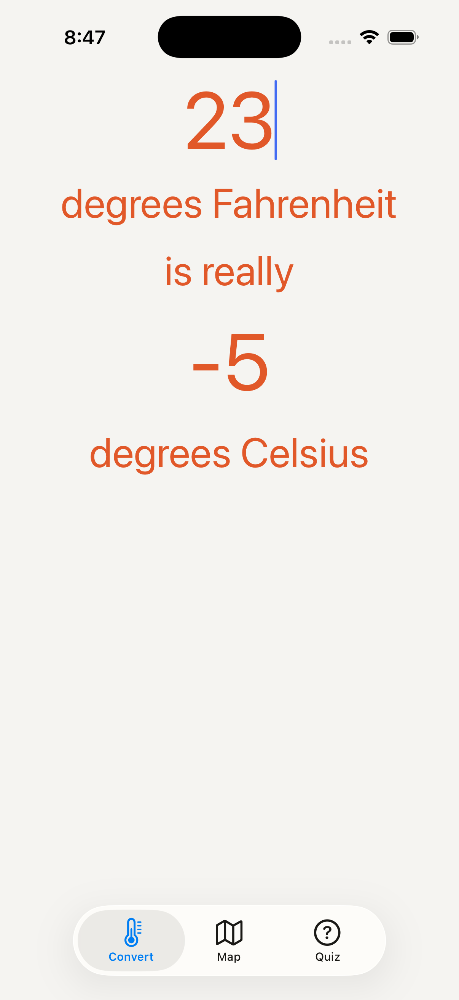

# WorldTrotter iOS App

An iOS application built with Swift and UIKit, featuring temperature conversion, interactive maps, quiz functionality, and internationalization support.

## Overview

This project demonstrates iOS app development concepts from Chapters 3-7, including:
- Programmatic Auto Layout and Interface Builder approaches
- Tab bar navigation
- MapKit integration with location services
- Interactive UI components
- Text input validation
- Custom gradient backgrounds
- Internationalization and localization

## Features

### Temperature Converter (Chapters 3, 6 & 7)
- Convert between Fahrenheit and Celsius
- Orange gradient background
- Three layout approaches: Bronze (basic), Silver (programmatic), Gold (advanced)
- Real-time conversion with custom formatting
- Input validation prevents alphabetic characters (Chapter 6 Bronze Challenge)
- Locale-aware decimal separator handling and NumberFormatter parsing (Chapter 7)

### Interactive Map (Chapters 4, 5, 6 & 7)
- MapKit integration with multiple view modes
- Points of interest toggle switch (Chapter 5 Bronze Challenge)
- User location detection and region display (Chapter 6 Silver Challenge)
- Map type selection: Standard, Satellite, Hybrid
- Localized map control titles using NSLocalizedString (Chapter 7)

### Quiz Interface (Chapter 4)
- Question and answer system
- Navigation between questions
- Answer reveal functionality

### Internationalization (Chapter 7)
- Support for multiple languages (English, French, Spanish)
- Locale-aware number formatting and input validation
- Localized strings for UI elements and map controls
- Base localization with language-specific string files

## Screenshots

### Chapter 3 - Advanced Auto Layout


*Gold challenge implementation with complex constraint relationships*

### Chapter 4 - Tab Bar Navigation
<div align="center">
  
  
  
</div>

*Temperature Converter, Quiz Interface, Interactive Map*

### Chapter 5 - Enhanced Map Features
<div align="center">
  
  
</div>

*Bronze: Points of Interest toggle switch | Silver: Programmatic UI implementation*

### Chapter 6 - Text Validation & Location Services
<div align="center">
  
  
  
</div>

*Bronze: Alphabetic character blocking | Silver: Location permission & user region display*

### Chapter 7 - Internationalization & Localization
<div align="center">
  
</div>

*Multi-language support: English, Spanish (Español), French (Français)*

## Technical Implementation

### Architecture
- **Pattern**: MVC (Model-View-Controller)
- **UI Approaches**: Both programmatic Auto Layout and Interface Builder
- **Navigation**: UITabBarController with three tabs
- **Maps**: MapKit framework with location services
- **Input Validation**: CharacterSet-based text filtering


```
worldTrotter_3/
├── worldTrotter/
│   ├── AppDelegate.swift
│   ├── SceneDelegate.swift
│   ├── ViewController.swift       # ConversionViewController
│   ├── Assets.xcassets/
│   ├── Base.lproj/
│   └── Info.plist
├── worldTrotterTests/
└── worldTrotterUITests/

worldTrotter_4/
├── worldTrotter/
│   ├── AppDelegate.swift
│   ├── SceneDelegate.swift
│   ├── ViewController.swift       # ConversionViewController
│   ├── MapViewController.swift
│   ├── QuizViewController.swift
│   ├── Assets.xcassets/
│   ├── Base.lproj/
│   └── Info.plist
├── worldTrotterTests/
└── worldTrotterUITests/

worldTrotter_5/
├── worldTrotter/
│   ├── AppDelegate.swift
│   ├── SceneDelegate.swift
│   ├── ViewController.swift       # ConversionViewController
│   ├── MapViewController.swift
│   ├── QuizViewController.swift
│   ├── Assets.xcassets/
│   ├── Base.lproj/
│   └── Info.plist
├── worldTrotterTests/
└── worldTrotterUITests/

worldTrotter_6/
├── worldTrotter/
│   ├── AppDelegate.swift
│   ├── SceneDelegate.swift
│   ├── ViewController.swift       # ConversionViewController
│   ├── MapViewController.swift
│   ├── QuizViewController.swift
│   ├── Assets.xcassets/
│   ├── Base.lproj/
│   └── Info.plist
├── worldTrotterTests/
└── worldTrotterUITests/

worldTrotter_7/
├── worldTrotter/
│   ├── AppDelegate.swift
│   ├── SceneDelegate.swift
│   ├── ViewController.swift       # ConversionViewController
│   ├── MapViewController.swift
│   ├── QuizViewController.swift
│   ├── Assets.xcassets/
│   ├── Base.lproj/
│   │   └── Main.storyboard
│   ├── en.lproj/
│   │   ├── Localizable.strings
│   │   └── Main.strings
│   ├── es.lproj/
│   │   ├── Localizable.strings
│   │   └── Main.strings
│   ├── fr.lproj/
│   │   ├── Localizable.strings
│   │   └── Main.strings
│   └── Info.plist
├── worldTrotterTests/
└── worldTrotterUITests/
```

## Build Information
- **iOS Deployment Target**: iOS 26.0
- **Xcode Version**: 17A400
- **Swift Version**: 5
- **Architecture**: arm64
- **Frameworks**: UIKit, MapKit, CoreLocation

## Requirements
- Xcode 17.0 or later
- iOS 26.0 or later
- Location services capability for Chapter 6 Silver Challenge

## Getting Started

1. Clone the repository
2. Choose the appropriate version:
   - `worldTrotter_3/`: Chapter 3 implementation
   - `worldTrotter_4/`: Chapter 4 implementation  
   - `worldTrotter_5/`: Chapter 5 implementation
   - `worldTrotter_6/`: Chapter 6 implementation
   - `worldTrotter_7/`: Chapter 7 implementation (internationalization)
3. Open the respective `.xcodeproj` file in Xcode
4. Build and run on iOS Simulator or device

## Challenges Completed

### Chapter 3 Challenges
- **Bronze**: Basic Auto Layout constraints
- **Silver**: Intermediate constraint relationships  
- **Gold**: Advanced Auto Layout with priority management and gradient backgrounds

### Chapter 4 Challenges
- Tab bar navigation implementation
- MapKit integration for interactive maps
- Quiz interface with question/answer flow
- Consistent naming and project organization

### Chapter 5 Challenges
- **Bronze**: Points of Interest toggle switch on map
- **Silver**: Complete programmatic UI implementation without Interface Builder

### Chapter 6 Challenges
- **Bronze**: Text input validation to disallow alphabetic characters using CharacterSet
- **Silver**: User location detection and region display with Core Location framework

### Chapter 7 Challenges
- **Bronze**: Internationalization and localization support
  - Locale-aware decimal separator handling in text input validation
  - NumberFormatter-based input parsing for proper locale support
  - NSLocalizedString implementation for map control titles
  - Multi-language support with Localizable.strings files
  - Base localization with language-specific Main.strings files

## Author
Built as part of CS397 coursework, demonstrating iOS development fundamentals from basic Auto Layout through advanced features like location services, input validation, and internationalization.