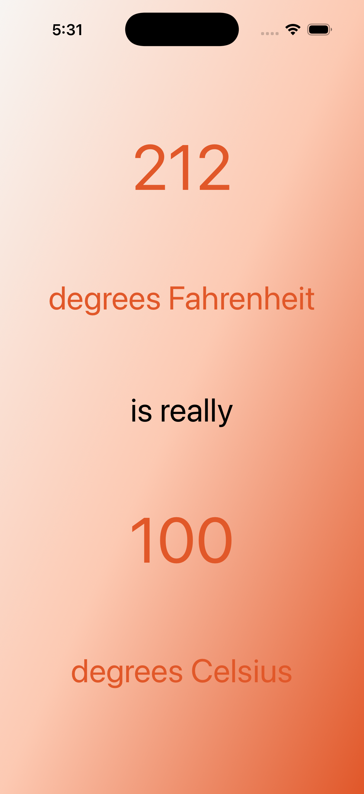

# WorldTrotter iOS App

An iOS application built with Swift and UIKit, featuring temperature conversion, interactive maps, and quiz functionality.

## Overview

This project demonstrates iOS app development concepts from Chapters 3 and 4, including:
- Programmatic Auto Layout with multiple layout modes
- Tab bar navigation
- MapKit integration
- Interactive UI components
- Custom gradient backgrounds

## Features

### Temperature Converter (Chapter 3)
- Convert between Fahrenheit and Celsius
- Beautiful orange gradient background
- Three layout modes: Bronze, Silver, and Gold
- Real-time conversion with custom formatting

### Interactive Map (Chapter 4)
- Full MapKit integration
- World map with detailed geographic information
- Smooth navigation and zooming
- Apple Maps data integration

### Quiz Interface (Chapter 4)
- Interactive question and answer system
- Navigation between questions
- Clean, user-friendly interface
- Answer reveal functionality

## Screenshots

### Chapter 3 - Gold Layout Mode

*Advanced Auto Layout implementation with sophisticated constraint management*

### Chapter 4 - Complete App
<div align="center">
  
  
  
</div>

*Left to Right: Temperature Converter, Quiz Interface, Interactive Map*

## Technical Implementation

### Architecture
- **Pattern**: MVC (Model-View-Controller)
- **UI Framework**: UIKit with programmatic Auto Layout
- **Navigation**: UITabBarController with three tabs
- **Maps**: MapKit framework integration

### Key Components
- `ConversionViewController`: Temperature conversion with multiple layout modes
- `QuizViewController`: Interactive quiz functionality
- `MapViewController`: MapKit-based map display
- `SceneDelegate`: Scene-based app lifecycle management

### Layout Modes (Chapter 3)
- **Bronze**: Basic Auto Layout constraints
- **Silver**: Intermediate constraint relationships
- **Gold**: Advanced Auto Layout with priority management

## Project Structure

```
worldTrotter_4/
├── worldTrotter/
│   ├── AppDelegate.swift
│   ├── SceneDelegate.swift
│   ├── ViewController.swift       # ConversionViewController
│   ├── MapViewController.swift
│   ├── QuizViewController.swift
│   ├── Assets.xcassets/
│   ├── Base.lproj/
│   └── Info.plist
├── worldTrotterTests/
└── worldTrotterUITests/
```

## Build Information
- **iOS Deployment Target**: iOS 26.0
- **Xcode Version**: 17A400
- **Swift Version**: 5
- **Architecture**: arm64

## Getting Started

1. Clone the repository
2. Open `worldTrotter_4/worldTrotter_4.xcodeproj` in Xcode
3. Build and run on iOS Simulator or device

## Challenges Completed

**Chapter 3 Challenges**
- Implemented Bronze, Silver, and Gold Auto Layout modes
- Created sophisticated constraint relationships
- Added custom gradient backgrounds

**Chapter 4 Challenges** 
- Built complete tab bar navigation
- Integrated MapKit for interactive maps
- Created quiz interface with question/answer flow
- Maintained consistent naming throughout project

## Author
Built as part of CS397 coursework, demonstrating iOS development fundamentals and advanced UI programming techniques.